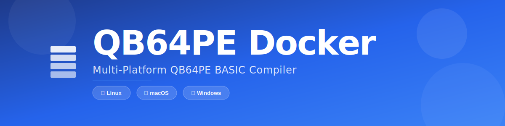
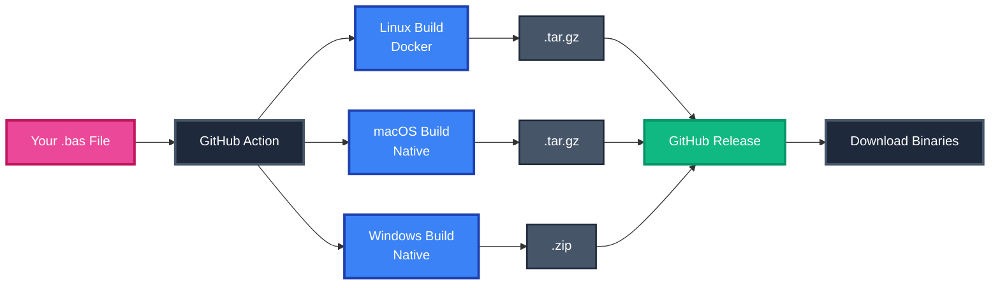
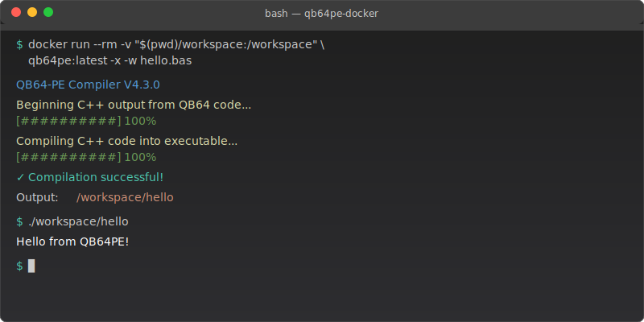
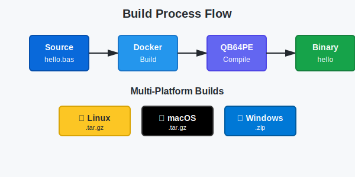
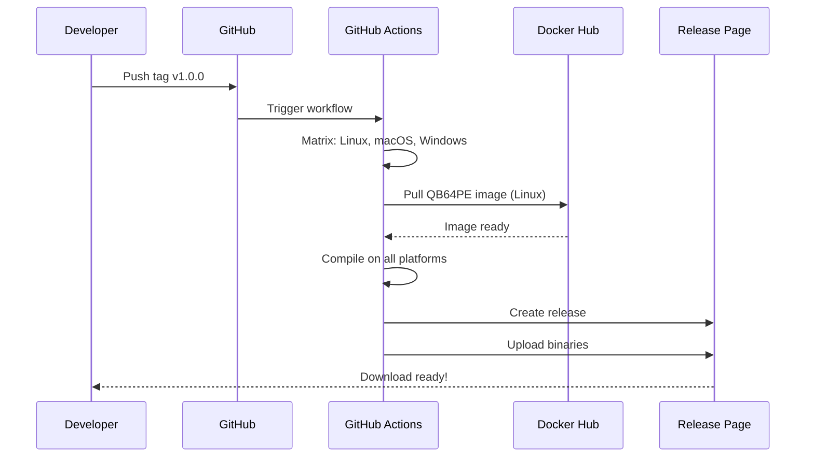

<div align="center">



[](https://github.com/grymmjack/qb64pe-docker/actions)
[](https://github.com/grymmjack/qb64pe-docker/actions)
[](https://opensource.org/licenses/MIT)
[](https://github.com/grymmjack/qb64pe-docker/pkgs/container/qb64pe)
[](https://github.com/QB64-Phoenix-Edition/QB64pe)

<p align="center">
  
</p>

A Docker container and GitHub Action for compiling QB64 BASIC programs using [QB64 Phoenix Edition (QB64PE)](https://github.com/QB64-Phoenix-Edition/QB64pe).

[Features](#features) •
[Quick Start](#-quick-start) •
[Documentation](#-documentation) •
[Examples](#-examples)

</div>

---

## Features

✅ **Multi-platform builds** - Build for Linux, macOS, and Windows in parallel  
✅ **Automatic releases** - Create GitHub releases with binaries for all platforms  
✅ **Smart packaging** - Include only what you need with `.qb64pe-ignore`  
✅ **Reusable action** - Drop-in workflow for any QB64PE project  
✅ **Docker support** - Compile locally or in CI/CD  
✅ **Latest QB64PE** - Built from source with configurable version  
✅ **Matrix builds** - Parallel compilation across platforms  

## 🏗️ Architecture



<div align="center">
  
  
  
</div>

## 🚀 Quick Start



### For QB64PE Project Developers (Recommended)

Add this to your QB64PE project's `.github/workflows/build.yml`:

```yaml
name: Build My QB64PE Project

on:
  push:
    branches: [ main ]
    tags: [ 'v*' ]

jobs:
  build:
    uses: grymmjack/qb64pe-docker/.github/workflows/reusable-build.yml@main
    with:
      source-file: 'src/main.bas'
      project-name: 'my-awesome-game'
      qb64pe-version: 'v4.3.0'
```

**What you get:**
- ✅ Builds for Linux, macOS, and Windows
- ✅ Downloadable artifacts for each platform
- ✅ Automatic releases when you push tags (e.g., `v1.0.0`)
- ✅ All binaries uploaded to GitHub releases

📖 [**Full Guide: Using as a Reusable Action**](docs/REUSABLE-ACTION.md)

### ⚡ One-Command Build Example

```bash
# Tag your code and push - that's it!
git tag v1.0.0 && git push origin v1.0.0

# GitHub Actions automatically:
# ✅ Builds for Linux, macOS, Windows
# ✅ Creates a GitHub Release
# ✅ Uploads all binaries
```

<details>
<summary>📸 See Example Release Output</summary>

```
✓ Build for linux completed
✓ Build for macos completed  
✓ Build for windows completed

📦 Created Release v1.0.0
   ├── my-game-lnx-x64.tar.gz  (1.2 MB)
   ├── my-game-osx-x64.tar.gz  (1.3 MB)
   └── my-game-win-x64.zip     (1.4 MB)
```

</details>

---

### 🔄 Build Process



---

### Using Docker Locally

#### Build the image

```bash
make build
```

#### Compile a QB64 program

```bash
docker run --rm -v "$(pwd):/workspace" qb64pe:latest -x -w yourprogram.bas -o yourprogram
```

#### Using the helper script

```bash
./qb64pe-compile.sh workspace/hello.bas hello
```

### Using Docker Compose

```bash
# Build the image
docker compose build

# Run a compilation
docker compose run --rm qb64pe -x -w hello.bas -o hello
```

## 🎬 GitHub Action Usage

### Reusable Workflow (Recommended)

The easiest way to build QB64PE projects for multiple platforms:

```yaml
jobs:
  build:
    uses: grymmjack/qb64pe-docker/.github/workflows/reusable-build.yml@main
    with:
      source-file: 'game.bas'
      project-name: 'retro-racer'
```

See [REUSABLE-ACTION.md](docs/REUSABLE-ACTION.md) for complete documentation.

#### 🔄 Workflow Visualization



### Direct Action Usage

For custom matrix builds:

```yaml
name: Build QB64 Program

on: [push]

jobs:
  build:
    name: Build for ${{ matrix.platform }}
    runs-on: ${{ matrix.os }}
    strategy:
      matrix:
        include:
          - os: ubuntu-latest
            platform: linux
          - os: macos-latest
            platform: macos
          - os: windows-latest
            platform: windows
    
    steps:
      - uses: actions/checkout@v4
      
      - uses: grymmjack/qb64pe-docker@main
        with:
          source-file: 'src/main.bas'
          project-name: 'my-program'
          platform: ${{ matrix.platform }}
          path: src/myprogram
```

### Advanced Example

```yaml
name: Multi-Platform Build

on:
  release:
    types: [ created ]

jobs:
  build:
    runs-on: ubuntu-latest
    strategy:
      matrix:
        program:
          - { source: 'game.bas', output: 'mygame' }
          - { source: 'tools/converter.bas', output: 'converter' }
    
    steps:
      - name: Checkout code
        uses: actions/checkout@v4
      
      - name: Compile ${{ matrix.program.output }}
        uses: grymmjack/qb64pe-docker@v1
        with:
          source: ${{ matrix.program.source }}
          output: ${{ matrix.program.output }}
          qb64pe-version: v3.15.0
      
      - name: Upload to release
        uses: actions/upload-release-asset@v1
        env:
          GITHUB_TOKEN: ${{ secrets.GITHUB_TOKEN }}
        with:
          upload_url: ${{ github.event.release.upload_url }}
          asset_path: ./${{ matrix.program.output }}
          asset_name: ${{ matrix.program.output }}-linux
          asset_content_type: application/octet-stream
```

## Action Inputs

| Input | Description | Required | Default |
|-------|-------------|----------|---------|
| `source` | Path to QB64 BASIC source file (.bas) | Yes | - |
| `output` | Name of output executable (without extension) | No | Source filename without .bas |
| `qb64pe-version` | QB64PE version to use (e.g., v3.15.0) | No | `v3.15.0` |
| `additional-flags` | Additional compiler flags | No | - |

## Action Outputs

| Output | Description |
|--------|-------------|
| `executable` | Path to the compiled executable |

## QB64PE Compiler Flags

The QB64PE compiler supports various flags:

- `-x` - Compile to executable
- `-w` - Show compilation warnings
- `-o <name>` - Specify output name
- `-c` - Console-only mode
- `-f` - Compiler settings (e.g., `-f:OptimizeForSpeed`)

Example with flags:
```yaml
- name: Compile with optimization
  uses: grymmjack/qb64pe-docker@v1
  with:
    source: game.bas
    output: game
    additional-flags: -f:OptimizeForSpeed
```

## Docker Image Tags

Images are available on GitHub Container Registry:

```bash
# Latest version
docker pull ghcr.io/grymmjack/qb64pe-docker:latest

# Specific version
docker pull ghcr.io/grymmjack/qb64pe-docker:v3.15.0
```

## Local Development

### Prerequisites

- Docker
- Docker Compose (optional)
- Bash (for helper scripts)

### Building locally

```bash
# Build with default QB64PE version
docker build -t qb64pe:latest .

# Build with specific version
docker build --build-arg QB64PE_VERSION=v3.14.1 -t qb64pe:v3.14.1 .
```

### Testing

A sample program is included in `workspace/hello.bas`:

```bash
# Using the helper script
./qb64pe-compile.sh workspace/hello.bas

# Using Docker directly
docker run --rm -v "$(pwd)/workspace:/workspace" qb64pe:latest -x -w hello.bas -o hello

# Check the compiled executable
ls -lh workspace/hello
```

## Project Structure

```
qb64pe-docker/
├── Dockerfile              # Multi-stage Docker build
├── docker-compose.yml      # Docker Compose configuration
├── action.yml             # GitHub Action definition
├── qb64pe-compile.sh      # Compilation helper script
├── .github/
│   └── workflows/
│       ├── docker-build.yml  # Build and push Docker image
│       └── test.yml          # Test the action
├── workspace/             # Sample QB64 programs
│   └── hello.bas
└── README.md
```

## How It Works

1. **Multi-stage Build**: The Dockerfile uses a two-stage build process:
   - **Builder stage**: Installs build dependencies and compiles QB64PE from source
   - **Runtime stage**: Copies only the compiled QB64PE and minimal runtime dependencies

2. **Small Image Size**: By using Debian Slim and only copying necessary files, the final image is kept small

3. **Universal Compatibility**: The Docker container provides a consistent Linux environment that works on macOS, Windows, and Linux hosts

4. **GitHub Actions Integration**: The action automatically pulls or builds the Docker image and compiles your QB64 programs in CI/CD pipelines

## System Requirements

### Docker Host
- Docker 20.10 or later
- Docker Compose 2.0 or later (optional)

### For Building
- 2GB+ RAM
- 2GB+ disk space

## 📚 Documentation

- 📖 [**Using as a Reusable Action**](docs/REUSABLE-ACTION.md) - Drop-in GitHub Action workflow
- 📦 [**Release Packaging with .qb64pe-ignore**](docs/QB64PE-IGNORE.md) - Control what goes into releases
- 📋 [**Usage Guide**](USAGE-GUIDE.md) - Detailed command examples
- 🚀 [**Quick Start**](QUICKSTART.md) - Get up and running fast
- 💡 [**Examples**](EXAMPLES.md) - Real-world use cases

## Contributing

Contributions are welcome! Please feel free to submit a Pull Request.

## License

This project is licensed under the MIT License - see the LICENSE file for details.

QB64 Phoenix Edition is licensed under the MIT License and the GNU LGPL - see the [QB64PE repository](https://github.com/QB64-Phoenix-Edition/QB64pe) for details.

## Links

- [QB64 Phoenix Edition](https://github.com/QB64-Phoenix-Edition/QB64pe)
- [QB64 Official Website](https://qb64phoenix.com/)
- [QB64 Forums](https://qb64phoenix.com/forum/)
- [Docker Hub](https://hub.docker.com/)
- [GitHub Container Registry](https://github.com/features/packages)

## Troubleshooting

### Permission Issues

If you encounter permission issues with the compiled executable:

```bash
docker run --rm -v "$(pwd):/workspace" --user $(id -u):$(id -g) qb64pe:latest -x -w program.bas
```

### Display Issues

QB64PE programs with graphics require X11. For GUI programs:

```bash
docker run --rm \
  -v "$(pwd):/workspace" \
  -e DISPLAY=$DISPLAY \
  -v /tmp/.X11-unix:/tmp/.X11-unix \
  qb64pe:latest -x -w program.bas
```

### Memory Issues

For large programs, increase Docker's memory limit:

```bash
docker run --rm -m 4g -v "$(pwd):/workspace" qb64pe:latest -x -w program.bas
```

## Support

- For QB64PE-specific issues: [QB64PE Issues](https://github.com/QB64-Phoenix-Edition/QB64pe/issues)
- For Docker container issues: [This Repository's Issues](https://github.com/grymmjack/qb64pe-docker/issues)
- For general QB64 help: [QB64 Forums](https://qb64phoenix.com/forum/)

---

Made with ❤️ for the QB64 community
